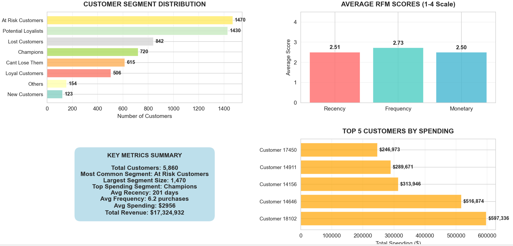
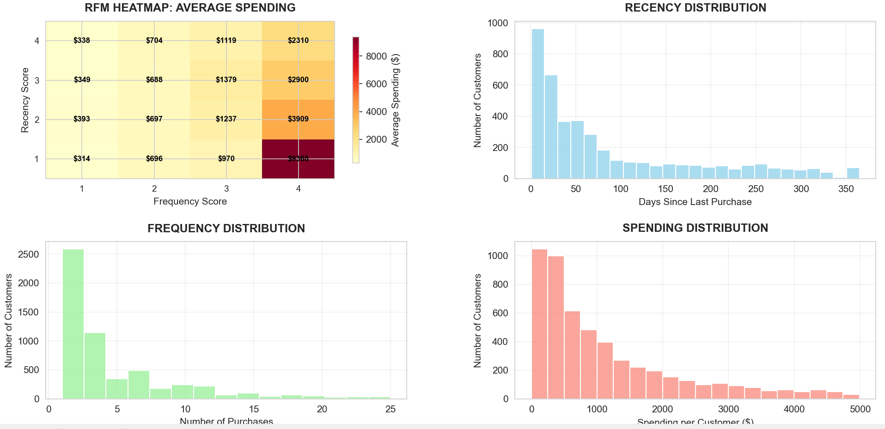

# RFM Customer Segmentation Analysis

A Python customer segmentation project that scores 5,706 retail customers on Recency, Frequency, and Monetary value, then turns seven discovered segments into specific marketing actions.



**At a glance:** 800,000+ transactions · 5,860 customers · 7 segments · 3 RFM dimensions scored 1 to 4 · 2 dashboard pages

## Problem

Treating every customer the same wastes marketing budget. Some customers are loyal and valuable, some are about to leave, and some are already gone. This project uses RFM modeling on real retail transaction data to separate those groups, so each one gets a retention or growth strategy that fits it.

## Key Numbers

| Metric | Value |
|---|---|
| Transactions Analyzed | 800,000+ |
| Customers Segmented | 5,860 |
| Segments Discovered | 7 |
| Top 5 Customer Revenue | $1.9M+ |
| High-Value Customers at Risk | 615 |

## How RFM Works

| Dimension | Question It Answers |
|---|---|
| **Recency** | How recently did the customer make a purchase? |
| **Frequency** | How often do they buy? |
| **Monetary** | How much do they spend in total? |

Combining the three scores places each customer in a segment with its own strategy.

## Key Design Decisions

**Quartile-based scoring.** Each customer is scored 1 to 4 on every dimension using quartile binning, so scores are relative to the customer base instead of depending on fixed thresholds.

**A readable 3-digit RFM code.** The three scores combine into a single code (for example, 444 is a Champion), which makes every customer's profile easy to read and filter.

**Rule-based segment assignment.** Segments come from explicit rules on R, F, and M score combinations rather than a black-box clustering model, so every segment is easy to explain to a marketing team.

**Segments tied to actions.** Every segment has a priority level and a concrete strategy, because a segment label only matters if it changes what the business does next.

## Results

### Customer Segments

| Segment | Customers | Priority | Strategy |
|---|---|---|---|
| Champions | 720 | 🟢 High | VIP rewards, early access, premium offers |
| Loyal Customers | 506 | 🟡 Medium | Tiered loyalty programs, exclusive discounts |
| Potential Loyalists | 1,430 | 🟡 Medium | Personalized recommendations, gentle nudges |
| New Customers | 123 | 🟡 Medium | Welcome series, onboarding journey |
| At Risk Customers | 1,470 | 🔴 High | Win-back campaigns, 15 to 20% discounts |
| Can't Lose Them | 615 | 🔴 Critical | Personal outreach, strong retention offers |
| Lost Customers | 842 | ⚫ Low | Surveys, last-chance comeback deals |

### RFM Deep Dive

The second dashboard page shows an RFM heatmap of average spending by Recency and Frequency score, plus the distributions of recency, frequency, and monetary value.



## Technical Implementation

```python
snapshot_date = df_clean['InvoiceDate'].max() + pd.Timedelta(days=1)

rfm = df_clean.groupby('Customer ID').agg({
    'InvoiceDate': lambda x: (snapshot_date - x.max()).days,  # Recency
    'Invoice': 'nunique',                                      # Frequency
    'TotalSales': 'sum'                                        # Monetary
})
rfm.columns = ['Recency', 'Frequency', 'Monetary']
```

## Dashboard Pages

| Page | What's on It |
|---|---|
| **Page 1: Customer Overview** | Segment distribution (horizontal bar chart), average RFM scores, key metrics summary, top 5 customers by revenue |
| **Page 2: RFM Deep Dive** | RFM heatmap (Recency × Frequency), plus recency, frequency, and monetary histograms |

## Tools & Technology

| Tool | Purpose |
|---|---|
| Python 3.8+ | Core language |
| pandas | Data cleaning and transformation |
| numpy | Numerical operations |
| matplotlib | Chart rendering |
| seaborn | Statistical visualizations |

## Dataset

A retail transactions dataset (`Online_Retail.csv`) with 800,000+ records. The dataset is not included in this repository.

## Applications

- **Customer Retention**: reach high-value customers before they churn
- **Win-Back Campaigns**: re-engage at-risk segments with targeted offers
- **Budget Allocation**: spend marketing budget where it has the most impact
- **Lifecycle Management**: manage customers from first purchase to loyalty, with data-backed decisions

## How to Run

1. Install the dependencies: `pip install pandas numpy matplotlib seaborn`
2. Obtain `Online_Retail.csv` and place it where `RFM_Analysis.py` expects it.
3. Run `python RFM_Analysis.py`.
4. The script generates the two dashboard pages shown above.

## Project Structure

```
├── RFM_Analysis.py                          # Main analysis script
├── images/                                  # Screenshots used in this README
│   ├── 01-segments-and-key-metrics.png
│   └── 02-rfm-heatmap-and-distributions.png
└── README.md
```
